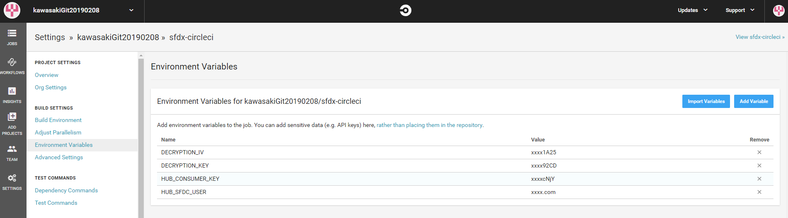
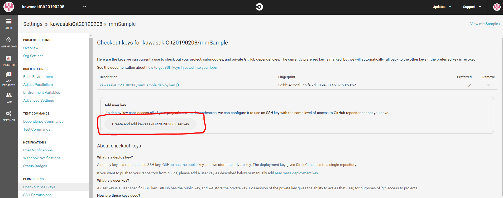

# Salesforce CLIを利用したCircleCI経由で自動化テストを行う環境構築手順
参考サイト  
https://trailhead.salesforce.com/ja/content/learn/modules/sfdx_travis_ci/sfdx_travis_ci_connected_app

## Opensslによる自己署名SSL証明書および非公開鍵の作成

server.keyファイルをローカルで暗号化するための鍵と初期化ベクトル（iv）を生成します。 
鍵とivはCircleciがビルド環境でserver.keyを復号化するのに使われます。  

windows版のopensslはこちらからダウンロードできます。  
(http://gnuwin32.sourceforge.net/packages/openssl.htm)  
**Complete package, except sources** をインストールしました。  

インストール後、[システムの詳細設定] -> [環境変数] -> [Path] -> [編集]にてopenssl.exeのあるディレクトリを追加してください。  
キーを作成する中で、openssl.cnfが必要となります。  
同じく環境変数を追加するか、コマンドプロンプト上でopenssl.cnfへのPathを通しておいてください。  
   [例] set OPENSSL_CONF=C:\Program Files (x86)\GnuWin32\share\openssl.cnf

1. Gitリポジトリディレクトリの外部に適当なディレクトリを作成してください。  
(mkdir certificates)

2. 作成したディレクトリに移動します。  
  cd certificates

3. RSA非公開鍵を作成します。  
  openssl genrsa -des3 -passout pass:x -out server.pass.key 2048

4. server.pass.keyファイルから鍵ファイルを作成します。  
  openssl rsa -passin pass:x -in server.pass.key -out server.key

5. server.pass.key を削除します。(rm server.pass.key)

6. 証明書を要求して生成します。  
  openssl req -new -key server.key -out server.csr  
  今回は以下の内容で設定しております。 

```bash
Country Name (2 letter code) [AU]:JP
State or Province Name (full name) [Some-State]:Tokyo
Locality Name (eg, city) []:Chuoku
Organization Name (eg, company) [Internet Widgits Pty Ltd]:MashMatrix
Organizational Unit Name (eg, section) []:.
Common Name (eg, YOUR name) []:mashmatrix
Email Address []:.
```

7. SSL証明書を生成します。  
  openssl x509 -req -sha256 -days 365 -in server.csr -signkey server.key -out server.crt

8. パスワードを[mashmatrix20190226]としてエンコードを行っております。  
  openssl enc -aes-256-cbc -k mashmatrix20190226 -P -md sha1 -nosalt

    キーとivが発行されます。
	key=718687FBF0530D0FAD7BE7BAB10EB53B349651C74CB90F35D7BF4FD544325E51  
	iv =76DCC1640468C2922F14DE0848F1B000

9. これらのキーを使ってserver.keyを暗号化します。暗号化したserver.key.encは後ほど使用します。  
  openssl enc -nosalt -aes-256-cbc -in server.key -out server.key.enc -base64 -K <key> -iv <iv>


## Salesforce CLIのインストール

1. こちらからダウンロードできます。(https://developer.salesforce.com/tools/sfdxcli)  
コマンドプロンプトを立ち上げて、`sfdx force --help` を実行してコマンドが実行できることを確認してください。

2. Salesforceの組織で、Dev Hubを有効化しておきます。

3. Dev Hubを既に認証している場合は、次のコマンドで開きます。  
  sfdx force:org:open -u DevHub

4. Dev Hub 組織にまだログインしていない場合はログインします。  
  sfdx force:auth:web:login -d -a DevHub

5. 組織をリストします。  
  sfdx force:org:list

```bash
        === Orgs
            ALIAS   USERNAME          ORG ID              CONNECTED STATUS
        ─── ─────── ────────────────  ──────────────────  ──────────────────
        (D) DevHub  user@dh0425.org   00DB0000000Ifd5MAC  Connected
```

## 接続アプリケーションの作成

#### 接続アプリケーションの作成

1. [設定] から、[クイック検索] ボックスに「アプリケーションマネージャ」と入力し、[アプリケーションマネージャ] を選択します。

2. [新規接続アプリケーション] をクリックします。

3. 接続アプリケーション名と自身のメールアドレスを入力します。  
    a) 接続アプリケーション名: <アプリケーション名>  
    b) 連絡先メール: <自身のメールアドレス>

4. [OAuth 設定の有効化] をオンにします。

5. コールバック URL を入力します。  
    `http://localhost:1717/OauthRedirect`

6. [デジタル署名を使用] をオンにします。

7. opensslで作成したserver.crt ファイルをアップロードするには、[ファイルを選択] をクリックします。

8. OAuth 範囲には、次の項目を追加します。  
    - データへのアクセスと管理 (api)
    - ユーザに代わっていつでも要求を実行 (refresh_token、offline_access)
    - Web 経由のデータへのアクセスを提供 (web)

9. [保存] をクリックします。

    **重要:** コンシューマ鍵は後で使用するため忘れずにコピーしておきます。

#### ポリシーの編集

1. [管理] をクリックします。

2. [ポリシーを編集] をクリックします。

3. [OAuth ポリシー] セクションの [許可されているユーザ] で、[管理者が承認したユーザは事前承認済み] を選択して、[OK] をクリックします。

4. [保存] をクリックします。

#### 権限セットの作成

1. [設定] から、[クイック検索] ボックスに「権限」と入力し、[権限セット] を選択します。

2. [新規] をクリックします。

3. [表示ラベル] に<権限セット名>を入力します。

4. [保存] をクリックします。

5. [権限セット名] | [割り当ての管理] | [割り当てを追加] をクリックします。

6. Dev Hub ユーザ名の横にあるチェックボックスをオンにして、[割り当て] | [完了] をクリックします。

7. 接続アプリケーションに戻ります。  
    a) [設定] から、[クイック検索] ボックスに「アプリケーションマネージャ」と入力し、[アプリケーションマネージャ] を選択します。 

    b) アプリケーション名 の横にあるリスト項目ドロップダウン矢印 (リスト項目ドロップダウン) をクリックして、[管理] をクリックします。  

    c) [権限セット] セクションで、[権限セットの管理] をクリックします。  

    d) [権限セット名] の横にあるチェックボックスをオンにして、[保存] をクリックします。  

#### 接続アプリケーションの接続確認

1. コマンドプロンプトから以下のコマンドを1行で入力します。Successfullyが返ってきたらJWT認証の接続確認OKです。

	- ${CONSUMER_KEY}=コンシューマーキー
	- ${JWT_KEY_FILE}=server.keyをフルパスで
	- ${HUB_USERNAME}=Dev Hubのユーザ名

```bash
	sfdx force:auth:jwt:grant --clientid ${CONSUMER_KEY} --username ${HUB_USERNAME} --jwtkeyfile ${JWT_KEY_FILE} --setdefaultdevhubusername
```

## GitHubとCircleCIの連携

1. GitのアカウントとCircleCIの連携を行ってください。  
  CircleCi側で、[UserSettings] -> [AccountIntegrations]にて、GitHubとの連携を行います。

2. [ADD PROJECTS] -> 対象プロジェクトを[Set Up Project]  

## CircleCIと接続アプリケーションの連携

1. [Setting] -> [Project] にて、対象となるプロジェクトの歯車アイコンをクリックします。

2. [Environment Variables]の[Add Variable]ボタンから以下の4つの環境変数を追加します。

    - HUB_CONSUMER_KEY: 作成した接続アプリのコンシューマキー
    - HUB_SFDC_USER: DevHub組織のユーザ名
    - DECRYPTION_KEY: 前の手順で作成した復号化のためのkey
    - DECRYPTION_IV: 前の手順で作成した復号化のためのiv



## GitHubへのリソースのPushとテスト実行

1. 前の手順で作成した暗号化したサーバーキー(server.key.enc)をリポジトリの assets/ に格納してPushします。

2. ./circleci/config.ymlで、テストの実施や実施結果のGitHubへのPushを行っています。

## CircleCIからGitHubへテスト結果をPushするためのアクセスキー追加

1. CircleCIからテスト結果をGitにPushするには、Gitリポジトリへの書き込み権限が必要となります。  
CircleCi -> [プロジェクト] -> [設定] -> 左メニュー[Checkout SSH keys] -> Add user key [Create and add リポジトリ名 user key]ボタン押下します。  

2. このボタンが出ていない場合は、Gitの設定で「SSH and GPG keys」というメニューがあるので、SSH keysを確認する。
read onlyのキーしか登録されていない場合は、一旦削除してCircleCI側からSSH keyを登録しなおしてください。  




## 補足

#### config.ymlについて

1. Gitリポジトリのアカウント部分が変更対象となります。2箇所ありますので適宜書き換えてください。  
 - git config user.email "hoge@example.com"
 - git config user.name "accountname"
 - git push origin master;
